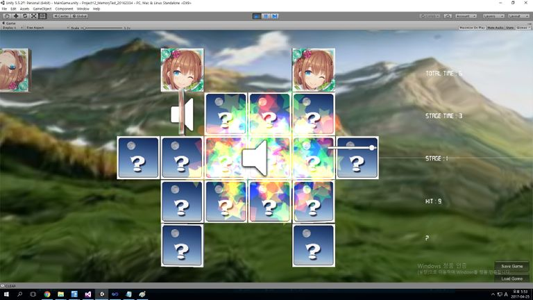
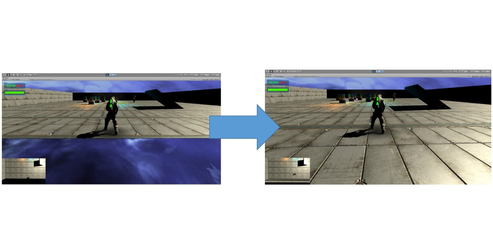
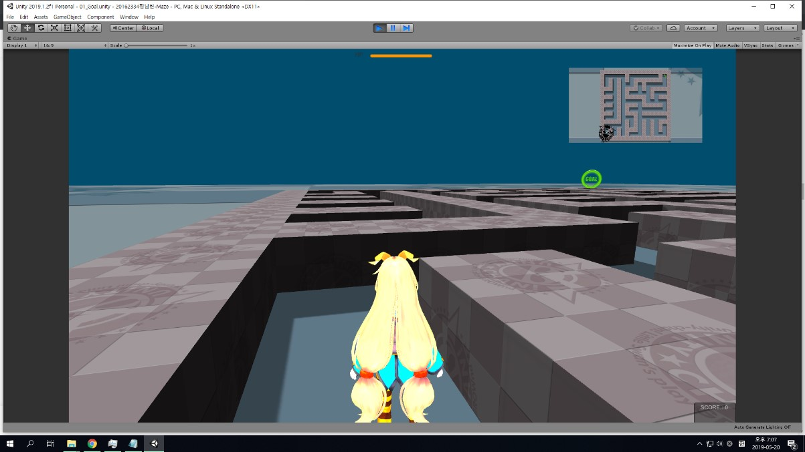
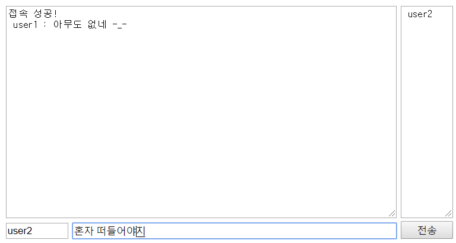
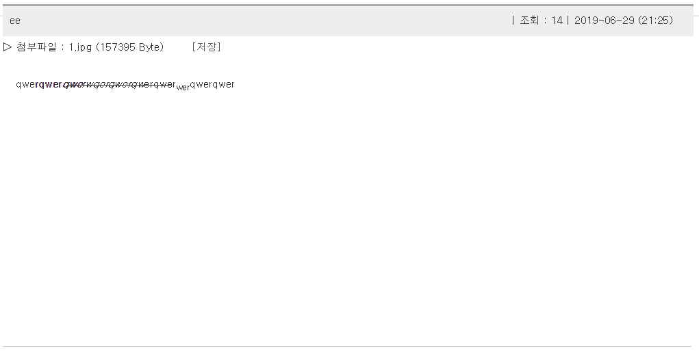
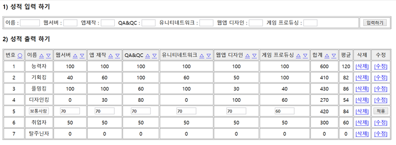

# 자기소개
안녕하세요, 정남헌입니다.

저는 학교에서 C, C#, JAVA, 자료구조, 운영체제 등의 기초지식을 공부했습니다.

그 외에는 unity, android studio, flash를 다룰 수 있습니다.

html, css, javascript, php&mysql, ajax를 이용한 웹 제작도 경험해본 적이 있습니다.

학창시절에는 유니티로 짝맞추기, 총게임, 미로게임을 제작하였고, javascript로 간단한 게임을 php+mysql로 쇼핑몰, 성적 처리 프로그램, 게시판, 채팅 프로그램 등을 제작하였습니다.

해당 프로젝트 소스와 기타 졸업 이후 제작한 프로젝트 들은 [https://github.com/wjdskagjs1](https://github.com/wjdskagjs1) 에서 보실 수 있습니다.

이후 저는 프린스턴 로보그램에서 유니티 강사 아르바이트를 1개월 한 뒤, 원제로소프트라는 ERP&쇼핑몰 회사에 조기취업하여 ERP 교육을 받고 B2B 쇼핑몰의 개발에 참여했습니다. 해당 사이트는 대진이라는 스포츠 용품 판매 업체에서 현재 사용중입니다.(http://daejin.smartb2b.co.kr/login/door).

  
학창시절 포트폴리오 스크린샷 

짝맞추기  

 

총게임  

 

미로게임  

 

채팅  

 

게시판  

 

성적 처리 프로그램  

 

쇼핑몰  

자바스크립트 게임  

 
