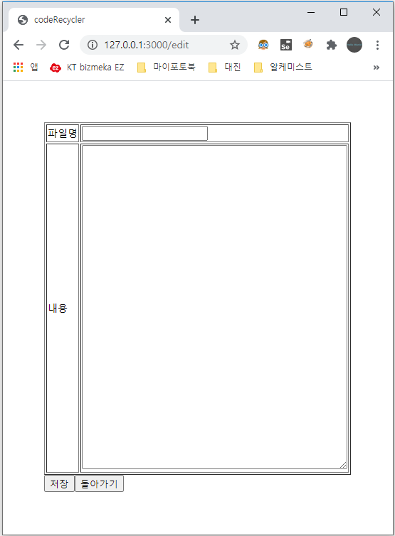

# 자기소개
안녕하세요, 정남헌입니다. 
 
장안대학교 게임컨텐츠학과를 졸업한 후 프린스턴 로보그램에서 유니티 강사 아르바이트를 1개월 한 뒤, 원제로소프트라는 ERP&쇼핑몰 회사에 조기취업하였습니다. 
회사에서는 ERP 교육을 받고 B2B 쇼핑몰, 택배사 설정 자동화 등의 개발에 참여했습니다. 
 
저는 다양한 언어를 할 줄 알지만 그 중에서 javascript가 가장 자신있습니다. 
그러므로 javascript 위주의 포트폴리오를 소개하겠습니다.

  
포트폴리오 
 
자바스크립트 게임  

 
제목 : simple JS game collection 
제작 년도 : 2019 
설명 : 간단한 자바스크립트 게임들을 모아둔 사이트. 
팀원 : 개인 프로젝트 
주요기능 : 
-1. 베스킨라빈스 31 게임 
-2. 경마게임 
-3. 벽돌깨기 게임 
-4. One Left 
 
소스 링크 : 
https://github.com/wjdskagjs1/simplejsgame/ 
https://wjdskagjs1.github.io/simplejsgame/ 
  

재사용 코드 메모장  

 
제목 : CodeRecycler 
제작 년도 : 2020 
설명 : 기록해두고 싶은 코드의 일부분을 기록해두는 메모장 
팀원 : 개인 프로젝트 
주요기능 : 
-node.js, express, fs 모듈 사용 
-새 파일, 저장, 불러오기 기능 
 
소스 링크 : 
https://github.com/wjdskagjs1/CodeRecycler 
  

애니 자음 퀴즈 디코봇  

 
제목 : AnimeConsonantQuiz 
제작 년도 : 2020 
설명 : 애니자음퀴즈를 할 수 있는 디스코드 챗봇 
팀원 : 개인 프로젝트 
주요기능 : 
-node.js, discord.js 사용 
-문제 등록 기능 
-문제 갯수 제한, 점수판 기능 
 
소스 링크 : 
https://github.com/wjdskagjs1/AnimeConsonantQuiz 
  