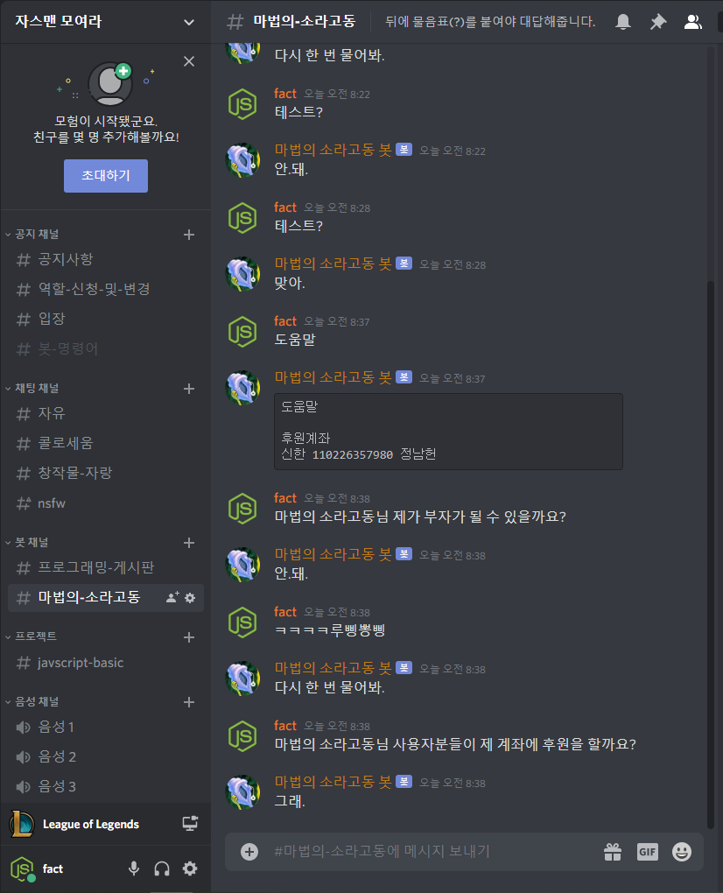

# 자기소개
 안녕하세요, 정남헌입니다.  
 장안대학교 게임컨텐츠학과를 졸업하였습니다.  
 유니티 강사 아르바이트 1개월 경험이 있습니다.  
 2019년 9월부터 ERP 솔루션 회사 다니면서 B2B 쇼핑몰 개발과 택배사 설정 자동 세팅 기능 개발에 참여한 경험이 있습니다.  
 C, C#, JAVA, javascript, php, mysql, VB6, node.js 등 왠만한 언어 다 다루어 보았습니다.  
 유니티, 안드로이드 스튜디오, 로블록스 스튜디오(lua) 등 다룰 줄 알며, 이와 비슷한 엔진들도 금방 익혀서 쓸 수 있습니다.  
 새로운 언어, 새로운 기술, 익혀야 한다면 금방 익힐 자신 있습니다.  
 최근에는 aws ec2, node.js, mysql을 이용한 애니자음퀴즈 디코봇을 개발하였습니다.  
 아직 부족하지만 부족한 만큼 노력하는 모습 보여드리겠습니다.  

  
포트폴리오 
 
자바스크립트 게임  

 
제목 : simple JS game collection 
제작 년도 : 2019 
설명 : 간단한 자바스크립트 게임들을 모아둔 사이트. 
주요기술 : html, css, javascript 
주요기능 : 
-1. 베스킨라빈스 31 게임 
-2. 경마게임 
-3. 벽돌깨기 게임 
-4. One Left 
 
소스 링크 : 
https://github.com/wjdskagjs1/simplejsgame/ 
https://wjdskagjs1.github.io/simplejsgame/ 
  

 
마법의 소라고동 디코봇  

 
제목 : 마법의 소라고동 디코봇 
제작 년도 : 2020 
설명 : 질문에 대해 정해진 답변을 랜덤하게 송신하는 디스코드 챗봇 
주요기술 : node.js, discord.js, gcp vm 
주요기능 : 
채팅채널 "마법의-소라고동"을 개설하시면 거기에서만 명령어를 사용할 수 있습니다. 
뒤에 물음표(?)가 붙어있지 않으면 다시 물어보라고 합니다. 
 
소스 링크 : 
https://github.com/wjdskagjs1/sorabot 
  

애니 자음 퀴즈 디코봇  

 
제목 : AnimeConsonantQuiz 
제작 년도 : 2020 
설명 : 애니자음퀴즈를 할 수 있는 디스코드 챗봇 
주요기술 : node.js, discord.js, mysql, aws ec2 
주요기능 : 
-문제 등록 기능 
-문제 갯수 제한, 점수판 기능 
 
소스 링크 : 
https://github.com/wjdskagjs1/AnimeConsonantQuiz 
  
